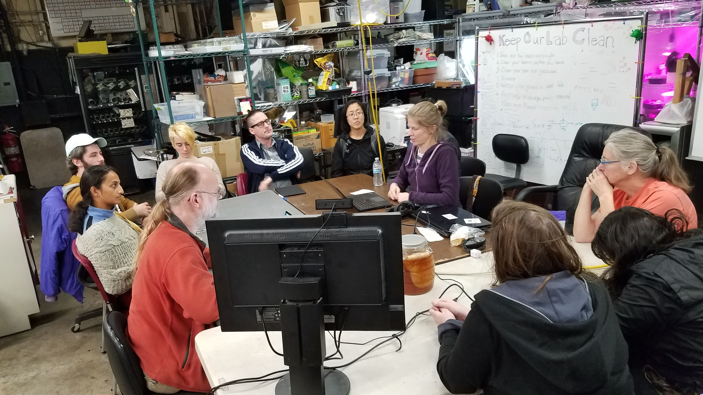
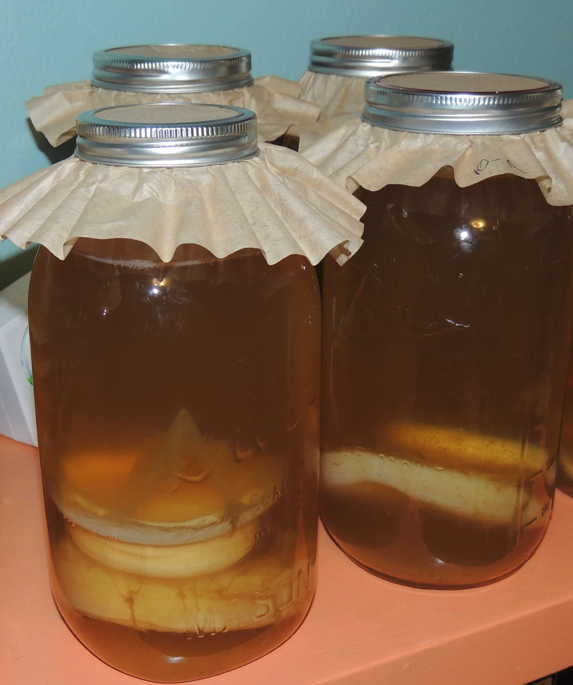

# Welcome to the home of
# __Kombucha Genomics__!

______________________________________

## __About__

Kombucha Genomics is a collaborative citizen science effort working to gain a better understanding of everyone's favorite vinegar-y beverage - Kombucha! Kombucha is a fermented beverage made from a symbiotic culture of bacteria and yeast(SCOBY). A SCOBY takes a mixture of black tea and sugar, degrades the sugars through anaerobic fermentation, and ultimately turns it into a refreshing beverage.

We're working to learn as much as we can about the micro-organism masterminds behind this delicious and ancient drink. Some of our next steps include: ribosomal sequencing of SCOBY micro-organisms, isolation of particular yeast and bacterial strains, and organizing classes to introduce community members to our work and the biological sciences.

______________________________________

#### Interested In Making Your Own?

Here are some recipes you can try out:

- [Cultures For Health](https://www.culturesforhealth.com/learn/kombucha/how-to-make-kombucha/)
- [The Kitchn](https://www.thekitchn.com/how-to-make-kombucha-tea-at-home-cooking-lessons-from-the-kitchn-173858)
- [Kombucha Kamp](https://www.kombuchakamp.com/kombucha-recipe)
- [Organic Authority](http://www.organicauthority.com/spirits-and-drinks/diy-4-ingredient-kombucha-recipe.html)
- [Wellness Mama](https://wellnessmama.com/2673/kombucha-recipe/)
- [Ifoodreal](http://ifoodreal.com/kombucha-recipe/)
- [Live Eat Learn](https://www.liveeatlearn.com/the-simple-guide-to-kickass-kombucha/)
- [Meghan Telpner](https://www.meghantelpner.com/blog/quick-and-easy-guide-to-brewing-kombucha/)

______________________________________

## Contribute
